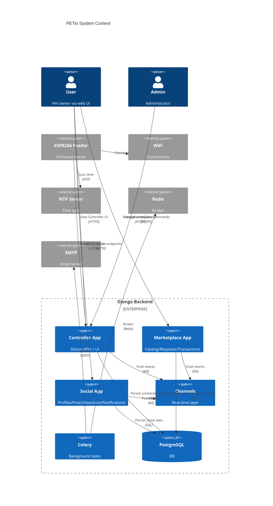
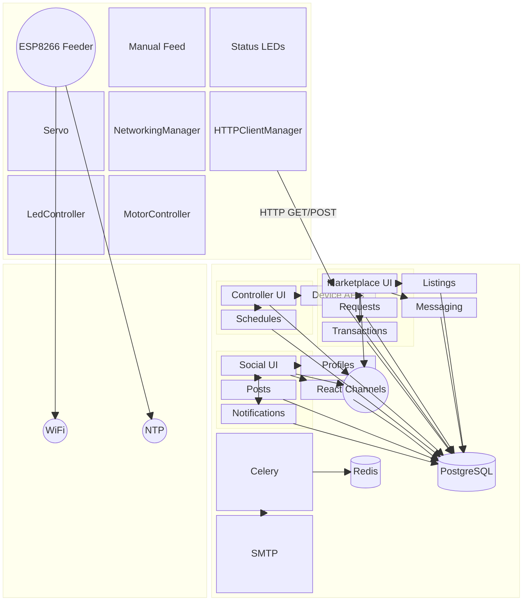

# PETio System Architecture Reference

This document is the definitive reference for designing, communicating, and maintaining PETio's system architecture across device firmware and Django-based backend applications. It is structured to help generate consistent architecture diagrams (C4Context, C4Container, Mermaid architecture-beta, and block diagrams) and serve as onboarding material.

## System Overview
- ESP8266 Feeder Device (Firmware)
  - Modules: NetworkingManager, HTTPClientManager, LedController, MotorController
  - Interfaces: WiFi (STA/AP), HTTP (device endpoints), NTP (time sync)
  - Inputs: Manual Feed Button, Portion Adjust Buttons, Serial CAL commands
  - Outputs: Servo Motor (MG996R), RGB LEDs
  - Behavior: Small/medium/large portion strategies, anti-jam, post-feed clearing

- Django Backend
  - Controller App
    - Device APIs: status, logs, commands, schedule
    - Web UI: schedules, pending commands, history, status
    - Data: FeedingSchedule, PendingCommand, FeedingLog, DeviceStatus
  - Marketplace App
    - Catalog, Listing Detail, Requests, Messaging, Transactions
    - Admin dashboards and analytics
    - Data: Category, Listing, PurchaseRequest, MessageThread/Message, Transaction, Report
  - Social App
    - Profiles, Posts, Reactions, Follows, Notifications
    - Moderation features
  - Infrastructure
    - Channels (real-time dispatch), Celery (background tasks), PostgreSQL (DB), Redis (broker), SMTP (email)

## External Dependencies
- WiFi network (device connectivity)
- NTP server (time synchronization)
- SMTP server (email notifications)
- Redis broker (task queue)

## Data Flows (Core)
- Device → Controller
  - Poll GET /api/device/command/; POST /api/device/command/ack/
  - Poll GET /api/check-schedule/
  - POST /api/device/status/ (heartbeat)
  - POST /api/device/logs/ (feeding logs)
  - Requires X-API-Key header; dev/prod keys must match firmware DEFAULT_API_KEY

- Controller UI → Models
  - Schedule creation and management
  - Feed-now command creation
  - History and status dashboards

- Marketplace
  - Requests lifecycle: pending → negotiate/accept/reject/cancel → meetup → payment → completed
  - Messaging threads between buyer and seller
  - Quick sell API for dashboard: /api/listings/<id>/sell/

- Social
  - Private follow decisions (request/approve/pending)
  - Notifications for interactions

## Decision Logic (Highlights)
- Schedule decision:
  - Local time (Asia/Manila) with tolerance window
  - Duplicate prevention via cache and recent logs
- Device feeding strategies:
  - Normal continuous feed for small portions
  - Chunked feeding with mini-agitation for medium portions
  - Reverse-clear cycles for large portions; post-feed clearing runs after all feeds
- Network resilience:
  - Short HTTP timeouts, single retry
  - Backoff (e.g., 60s) on failures to avoid loop blocking

## Security & Environment
- Dev
  - ALLOWED_HOSTS: 127.0.0.1, localhost, 192.168.18.9
  - PETIO_DEVICE_API_KEY configured in dev.py; match firmware
  - Runserver bound to 0.0.0.0:8000; firewall allowed
- Prod
  - HTTPS domain (petio.site); TLS verification recommended (CA pinning on device)
  - ALLOWED_HOSTS includes production domains only

## Diagram Templates

### Mermaid C4Context (System Context)

### Mermaid block (Subsystem View)

## Code References
- Firmware: [Firmware.ino](file:///d:/PETio/controller/firmware/Firmware/Firmware.ino)
- Controller URLs/API: [urls.py](file:///d:/PETio/controller/urls.py#L1-L59), [device_api.py](file:///d:/PETio/controller/device_api.py#L1-L298)
- Marketplace: [urls.py](file:///d:/PETio/marketplace/urls.py#L33-L142), [views.py](file:///d:/PETio/marketplace/views.py), [test_app.py](file:///d:/PETio/marketplace/test_app.py)
- Social: app views/models
- Settings: [dev.py](file:///d:/PETio/project/settings/dev.py), [base.py](file:///d:/PETio/project/settings/base.py), [prod.py](file:///d:/PETio/project/settings/prod.py)
