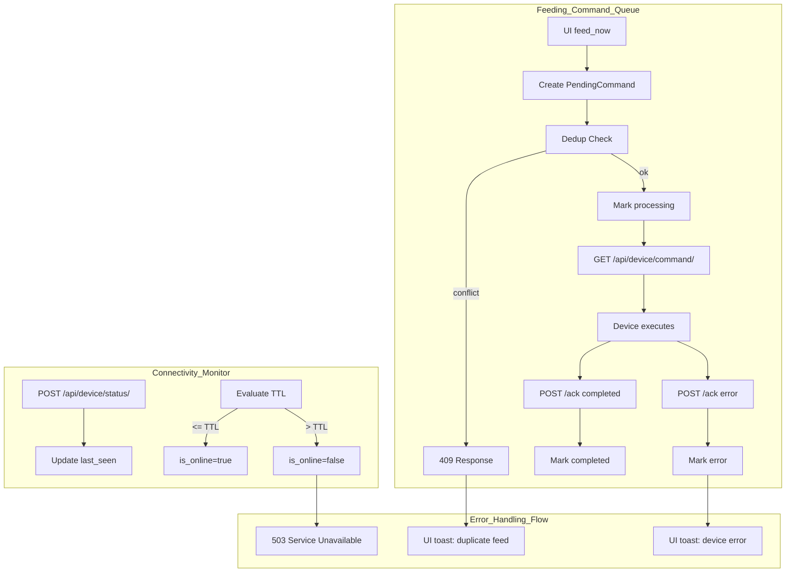
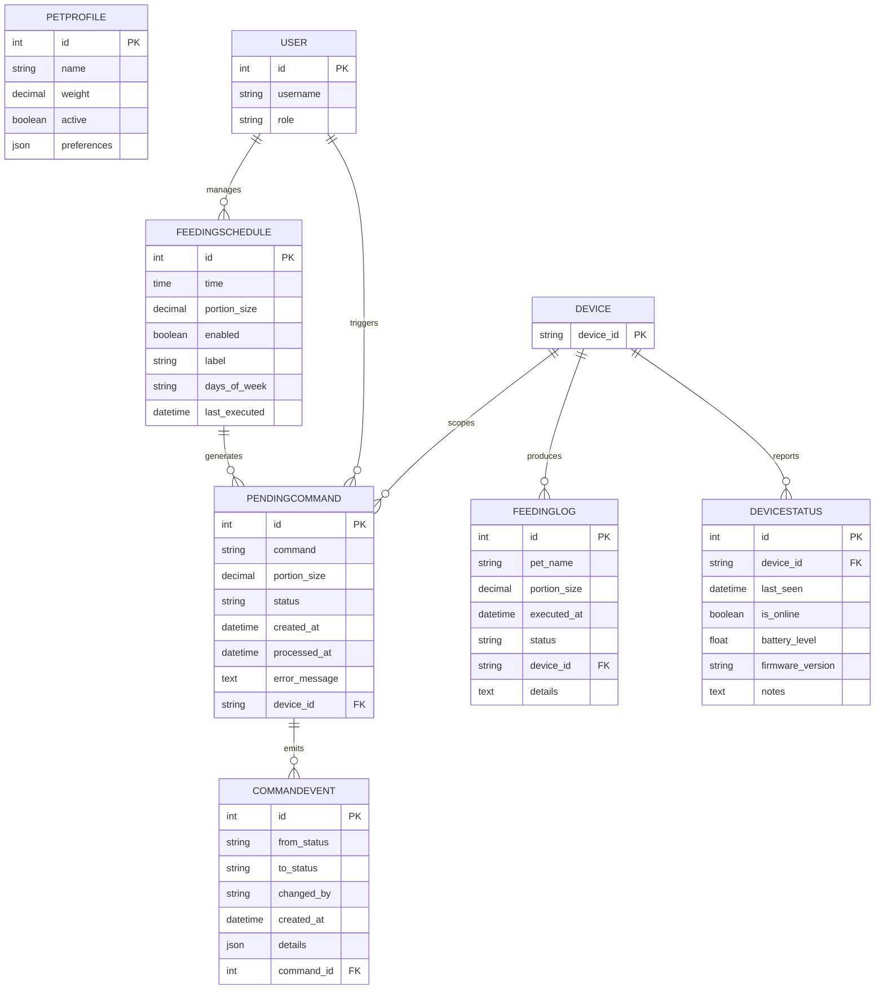

# PETio System Design Documentation

Documentation Version: v2.0 — Post-Refactor (Controller Stability Update)

## Overview
- Scope: Controller app (Django + DRF) with device endpoints, web UI, and persistence.
- Focus: Refactored command flow, normalized API responses, device connectivity logic, and consistent scoping via `device_id`.
- Hardware: ESP8266 firmware polling unified endpoints for commands, sending logs and status heartbeats.
- Datastore: Django ORM models for `PendingCommand`, `FeedingLog`, `DeviceStatus`, `CommandEvent`, `FeedingSchedule`, `PetProfile`.

## Refactored Command Flow
- Unified device endpoints:
  - `GET /api/device/command/` → fetch next pending command for `device_id`, marks `processing`.
  - `POST /api/device/command/ack/` → acknowledge command execution (`completed` or `error`).
  - Legacy wrappers preserved: `GET /api/device/feed-command/`, `POST /api/device/acknowledge/`.
- Concurrency: `select_for_update(skip_locked=True)` to ensure one device processes one command at a time.
- Status lifecycle: `pending → processing → completed` (or `error`), recorded in `PendingCommand` and `CommandEvent`.
- Dedup/Conflict: If a duplicate immediate feed is attempted, server returns `409 Conflict` and UI surfaces a toast.

## Connectivity Logic
- Device heartbeat: `POST /api/device/status/` records `last_seen`, `is_online`, and metadata in `DeviceStatus`.
- TTL fallback: `GET /api/device-status/` evaluates online/offline using `TTL_SECONDS` (from settings) against `last_seen`.
- Health signals: Device polls `GET /api/device/config/` and `GET /api/device/command/`; the backend returns structured hints, poll intervals, and endpoint URLs.

## Authentication & Throttling
- Authentication: `_device_api_key_valid(request)` validates API key on device endpoints; unauthorized requests return `403`.
- Throttling: Custom throttles on `feed_now` and `device_status` reduce abuse/load while preserving UX and device responsiveness.
- Context propagation: Web UI injects `DEVICE_ID` into scripts; commands, status, and logs are scoped accordingly.

## Normalized API Responses
- `_resp_ok(message, extra=None)` → `{status:"ok", message, success:true, ...extra}` with `200 OK`.
- `_resp_error(message, http_status)` → `{status:"error", message, success:false, error:message}` with appropriate HTTP status.
- Typical statuses:
  - `200 OK` success for fetch/ack/config/logs/status.
  - `409 Conflict` duplicate/overlap attempts (e.g., immediate feed collision).
  - `503 Service Unavailable` device offline for time-sensitive actions.

## Key Endpoints (Controller)
- Device API (firmware):
  - `GET /api/device/config/` — schedules, endpoint hints, poll interval.
  - `GET /api/device/command/` — next pending command (device-scoped).
  - `POST /api/device/command/ack/` — acknowledge execution result.
  - `POST /api/device/logs/` — push execution logs and telemetry.
  - `POST /api/device/status/` — heartbeat with metadata.
- Web UI + control:
  - `POST /feed_now/` — create immediate `PendingCommand` (UI sends `device_id`).
  - `GET /api/device-status/` — online/offline with TTL fallback for UI.
  - `GET /history/`, `GET /schedules/` — view logs and manage schedules.

## Data Flow Diagrams

> Source files are provided to regenerate diagrams; rendered PNGs are included when available. If PNG rendering is blocked by OS policy, the embedded Mermaid blocks below can be used directly.

### DFD Level 0 — Context Diagram
- See `docs/dfd_level0.mmd` (Mermaid) and `docs/dfd_level0.png` (rendered).

```mermaid
flowchart LR
  ext[ESP8266 Firmware]
  ctrl[Django Controller App]
  ui[End-User Web Interface]
  admin[Admin/Moderator Dashboard]
  fb[Firebase Notifications]
  db[(Database)]

  ext -->|poll command| ctrl
  ext -->|ack command| ctrl
  ext -->|push logs| ctrl
  ext -->|heartbeat status| ctrl

  ui -->|feed_now| ctrl
  ui -->|device_status| ctrl

  admin -->|manage schedules & review logs| ctrl

  ctrl -->|persist commands/logs/status| db
  ctrl -->|notify events (optional)| fb
  ctrl -->|normalized responses + API key validation| ext
```

### DFD Level 1 — Core Processes
- See `docs/dfd_level1.mmd` and `docs/dfd_level1.png`.

```mermaid
flowchart TD
  subgraph Feeding_Command_Management
    UI[Web UI feed_now]
    PC[(PendingCommand Store)]
    DF[Device Fetch]
    ACK[Device Ack]

    UI -->|POST /feed_now (device_id)| PC
    DF -->|GET /api/device/command/| PC
    DF -->|returns next pending, marks processing| ACK
    ACK -->|POST /api/device/command/ack/| PC
  end

  subgraph Device_Connectivity_Status_Update
    HB[Heartbeat]
    DS[(DeviceStatus Store)]
    TTL[TTL Fallback]

    HB -->|POST /api/device/status/| DS
    TTL -->|GET /api/device-status/| DS
  end

  subgraph User_Scheduling_Control_Interface
    SCHED_UI[Schedules UI]
    FS[(FeedingSchedule Store)]
    GEN_CMD[Generate Commands]

    SCHED_UI -->|CRUD| FS
    FS --> GEN_CMD
    GEN_CMD --> PC
  end

  subgraph Feeding_Log_Sync
    DEV_LOGS[Device Logs]
    FL[(FeedingLog Store)]
    UI_LOGS[History UI]

    DEV_LOGS -->|POST /api/device/logs/| FL
    UI_LOGS -->|GET /history| FL
  end

  subgraph Authentication_API_Key_Validation
    KEY[API Key]
    VALIDATE[_device_api_key_valid]

    KEY --> VALIDATE
    VALIDATE --> DF
    VALIDATE --> ACK
    VALIDATE --> HB
    VALIDATE --> DEV_LOGS
    VALIDATE --> CONFIG[GET /api/device/config/]
  end
```

### DFD Level 2 — Internal Logic
- See `docs/dfd_level2.mmd` and `docs/dfd_level2.png`.



## Entity Relationship Diagram (ERD)
- See `docs/erd.mmd` and `docs/erd.png`.
- Core entities and relationships reflect 3NF: single-purpose tables, no repeating groups, non-key attributes depend only on the key.



### 3NF Normalization Justification
- Each table uses a primary key: `id` or `device_id` (conceptual Device).
- Device-scoped data (`PendingCommand`, `FeedingLog`, `CommandEvent`, `DeviceStatus`) references `device_id`, avoiding redundant device attributes.
- Event history (`CommandEvent`) depends on `command_id` and captures transitions without duplicating command attributes.
- Schedules (`FeedingSchedule`) are independent and can generate commands without embedding runtime results.

## System Flowchart — Feeding Lifecycle
- See `docs/system_flowchart.mmd` and `docs/system_flowchart.png`.

```mermaid
flowchart TD
  A[User clicks "Feed Now" in UI] --> B[POST /feed_now with device_id]
  B --> C{Device online?}
  C -->|No| C1[Return 503 Service Unavailable]
  C1 --> C2[UI shows offline toast]
  C -->|Yes| D[Create PendingCommand (pending)]
  D --> E[Device polls GET /api/device/command/]
  E --> F[Server returns next command; marks processing]
  F --> G[Device executes command]
  G --> H{Execution success?}
  H -->|No| I[POST /api/device/command/ack/ with error]
  I --> J[PendingCommand -> error]
  J --> K[Create FeedingLog (status:error)]
  K --> L[UI updates history]
  H -->|Yes| M[POST /api/device/command/ack/ completed]
  M --> N[PendingCommand -> completed]
  N --> O[Create FeedingLog (status:success)]
  O --> P[UI updates history]

  subgraph Alternate Paths
    D1[Duplicate feed detected]
    D1 --> D2[Return 409 Conflict]
    D2 --> D3[UI shows duplicate/conflict toast]
  end
```

## System Architecture Diagram
- See `docs/system_architecture.mmd` and `docs/system_architecture.png`.

```mermaid
flowchart TB
  subgraph Frontend_Layer
    TPL[Django Templates]
    JS[Controller UI JS]
  end

  subgraph Backend_Layer
    VIEWS[Django Views]
    DRF[REST Endpoints]
    DEVICE_API[Device API]
    TASKS[Celery Tasks (optional)]
  end

  subgraph Database_Layer
    ORM[ORM Models]
    DB[(SQLite/PostgreSQL)]
  end

  subgraph Hardware_Layer
    MCU[ESP8266]
    SERVO[MG996R Servo]
    LED[LED Indicators]
  end

  subgraph Communication_Layer
    HTTP[HTTP Polling/Ack/Health]
  end

  subgraph Optional_Services
    FIREBASE[Firebase Notifications]
    ANALYTICS[Admin Analytics]
  end

  TPL --> JS
  JS -->|feed_now, status poll| VIEWS
  VIEWS --> DRF
  DRF --> DEVICE_API
  DEVICE_API -->|normalized responses + API key validation| MCU
  DEVICE_API --> ORM
  ORM --> DB
  MCU -->|command fetch, ack, logs, heartbeat| DEVICE_API
  DEVICE_API -->|events| FIREBASE
  VIEWS --> ANALYTICS
```

## Versioning Notes
- Documentation Version: v2.0 — Post-Refactor (Controller Stability Update).
- Aligns with device-scoped command processing (`device_id`) and normalized responses (`_resp_ok`, `_resp_error`).
- Uses `completed` over legacy `processed` terminology.

## Regeneration Instructions
- Install Mermaid CLI: `npm i -g @mermaid-js/mermaid-cli`.
- Render: `mmdc -i docs/dfd_level0.mmd -o docs/dfd_level0.png` (repeat for other `.mmd` files).
- If OS policies block `npx`/scripts execution, render using the embedded Mermaid blocks within this markdown in a renderer that supports Mermaid.